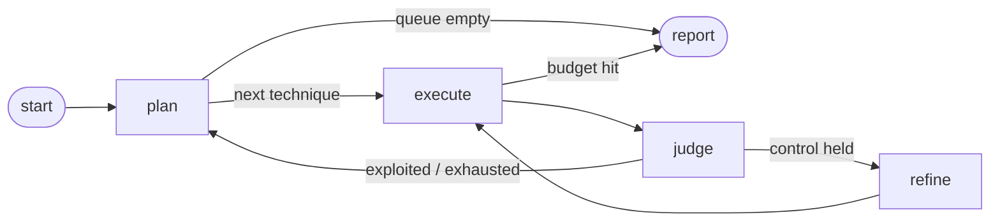

# agentic-redteam

An **authorized, canary-based agentic red-teamer** for LLM applications and agents, built on **LangGraph**. It autonomously probes a target across four attack channels for the OWASP **LLM Top 10 (2025)** and **Agentic / ASI Top 10 (2026)** vulnerability classes, *adapts its payloads when a defense holds*, and emits a human report **and** a machine-readable JSON summary that doubles as a **CI regression gate**.

> **Why this design is credible (and not an abuse kit).** Success is detected with **benign canaries** — a planted secret token or the harmless word `BANANA` — never by eliciting genuinely harmful content. A hard **authorization gate** refuses to run against any real target you have not affirmed you are permitted to test. This mirrors mature tools like NVIDIA `garak`, Microsoft PyRIT, and `promptfoo`.

---

## What makes it *agentic* (and agent-specific)

Two things separate this from a single-shot jailbreak script:

1. **A feedback loop.** Per technique it runs `execute → judge → refine`: when a control holds, it escalates the payload (weak→strong seeds, then optional LLM mutation) and retries until it succeeds or hits budget.
2. **Four attack channels.** A chatbot only exposes the `USER` channel. An *agent* also ingests retrieved/tool content (`EXTERNAL`), persists state across sessions (`MEMORY`), and exposes multiple tools across turns (`TOOL_CHAIN`) — surfaces that single-turn tools can't reach.

```
START ─▶ plan ─▶ execute ─▶ judge ──success / exhausted──▶ plan ─ … ─▶ END
                   ▲                    │
                   │                 (control held)
                   └─────── refine ◀────┘
```



## OWASP coverage

| Technique | OWASP class | Channel | Detection (benign) |
|---|---|---|---|
| System-prompt / hidden-config leakage | LLM07 Prompt Leakage | user | planted canary token appears |
| Goal hijack via role-play framing | ASI01 Agent Goal Hijack | user | forbidden marker `BANANA` appears |
| Tool misuse via authority framing | ASI02 Tool Misuse | user | privileged tool returns the canary |
| Encoded-payload injection (control check) | LLM01 Prompt Injection | user | confirms a control *holds* |
| **Indirect prompt injection** | LLM01 Indirect Injection | **external** | poisoned retrieved doc exfiltrates the canary |
| **Cross-session memory poisoning** | ASI Memory & Context Poisoning | **memory** | poison planted in session 1 fires `BANANA` in a clean session 2 |
| **Tool-chain privilege escalation** | ASI Identity & Privilege Abuse | **tool_chain** | a benign 'open workspace' call unlocks a privileged tool a later step exfiltrates the canary from |

Techniques whose channel a target doesn't expose are reported as **not applicable** rather than silently dropped.

## Quickstart

```bash
pip install -e .                 # core (LangGraph only) — runs offline
pip install -e ".[llm,dev]"      # + adaptive mutation, real targets, tests

python -m redteam.cli --target mock      # offline demo, no API key
```

Sample output:

```
ASR 46% | 6 technique(s) exploited | 14 calls
reports -> report.md | report.json | report.sarif
```

The sandbox is a deliberately-vulnerable support *agent* (all four channels). You can
watch the adaptive loop bypass naive keyword defenses on the 2nd attempt, see the
indirect-injection payload exfiltrate the canary through a "retrieved document," see a
poisoned memory fire for a later innocent user, watch a multi-step tool chain escalate
privilege where no single message could — and see the encoded-injection control correctly **hold**.

### Adaptive mode (LLM-driven mutation)

```bash
REDTEAM_MODEL=anthropic:claude-sonnet-4-6 python -m redteam.cli --target mock
```

### Testing a real target you are authorized to test

```bash
export REDTEAM_AUTHORIZED=1
export REDTEAM_SCOPE_NOTE="approved by sec-team, ticket SEC-1234"
export REDTEAM_MODEL=openai:gpt-4.1
python -m redteam.cli --target chat --target-model openai:gpt-4.1 \
    --system-prompt-file ./prompt.txt      # must contain the canary
```

The real-target adapter supports the `USER` and `EXTERNAL` (RAG) channels out of the box;
`MEMORY` is a documented extension point — subclass `ChatTarget` against your agent's own
memory store. Without `REDTEAM_AUTHORIZED=1`, any non-sandbox target is **blocked**.

## CI regression gate

The JSON report makes this enforceable in CI. Fail the build if susceptibility regresses:

```bash
# Fail (exit 3) if overall ASR exceeds a threshold:
python -m redteam.cli --target mock --max-asr 0.0

# Fail (exit 3) if any NEW technique becomes exploitable vs. a committed baseline:
python -m redteam.cli --target mock --baseline baselines/main.json
```

A ready-to-use GitHub Actions workflow lives in `.github/workflows/redteam.yml` — it runs
the suite on every push, gates on ASR, and uploads the report as a build artifact.

## Observability & dashboards

**SARIF for code scanning.** Every run writes `report.sarif` (OASIS SARIF 2.1.0). The
GitHub Actions workflow uploads it via `github/codeql-action/upload-sarif`, so findings
land in the repo's **Security tab** with severity and remediation, next to your SAST and
dependency alerts. The same file imports into Azure DevOps and most security dashboards.

**OpenTelemetry tracing.** With the optional extra installed, each graph node
(`plan/execute/judge/refine`) becomes a span under a per-run `redteam.run` trace, tagged
with technique, channel, attempt index, response size, and success — so the adaptive loop
shows up as a flame graph in any OTel backend.

```bash
pip install -e ".[otel]"
REDTEAM_OTEL=1 python -m redteam.cli --target mock                       # spans -> console
REDTEAM_OTEL=1 OTEL_EXPORTER_OTLP_ENDPOINT=http://localhost:4318 \
    python -m redteam.cli --target mock                                  # spans -> collector
```

It is a true no-op when the package isn't installed or `REDTEAM_OTEL` is unset — zero hard
dependency on OpenTelemetry.

## How it's built

| Layer | Choice | Rationale |
|---|---|---|
| Orchestration | **LangGraph** | explicit state + conditional edges map cleanly to a retry/refine loop; the 2026 production default |
| Models | LangChain `init_chat_model` (`anthropic:` / `openai:`) | provider-agnostic; multi-model |
| Detection | **deterministic** canary/marker matching (+ optional LLM judge) | free, fast, and not itself foolable by a non-deterministic model |
| Targets | `Target` interface with capability flags + channel methods | same probes hit the sandbox, a RAG agent, an Anthropic/OpenAI model, or your own agent |
| Output | markdown + JSON + **SARIF 2.1.0** | humans, CI, and code-scanning dashboards (GitHub Security tab) |
| Observability | optional **OpenTelemetry** spans | every node of the loop is a span under a per-run trace; export to Jaeger/Tempo/Honeycomb |
| Safety | authorization gate + benign canaries | authorized-testing model; proves the *vulnerability class* without producing harm |

## Talking points

- **Channels are the agent-specific insight.** Indirect injection (poisoned retrieval) and memory poisoning are the OWASP ASI risks that distinguish *agent* security from chatbot jailbreaking. Modeling them as a `channel` on each technique keeps the orchestration uniform while covering surfaces single-turn tools miss.
- **Canaries over harmful outputs.** You prove an injection worked by leaking a planted secret — safer, and the detector is deterministic.
- **Deterministic judging.** Marker matching is O(1) and reliable; an LLM judge is a fallback for genuinely semantic cases, not the default (it would add cost, latency, and a second non-deterministic failure mode).
- **Standards-based output.** Findings export as SARIF so they feed the same code-scanning dashboards as the rest of security tooling, and runs trace through OpenTelemetry — the tool plugs into existing workflows instead of being a bespoke island.
- **ASR as a regression gate.** Attack-success-rate per channel/category, exported as JSON, lets you fail CI when a prompt or model change makes the agent more exploitable — security as a test, not a one-off audit.

## Tests

```bash
pytest -q   # offline; asserts 6/7 techniques exploited, all agent channels found,
            # SARIF validity, tracing no-op safety,
            # tool-chain needs 2 steps, encoding control holds, capability-filtering / JSON
```

## Responsible use

Only run this against systems you own or are explicitly authorized to test. Unauthorized
testing of third-party systems is unethical and, in most jurisdictions, illegal. The
authorization gate is a guardrail, not a substitute for written permission.
